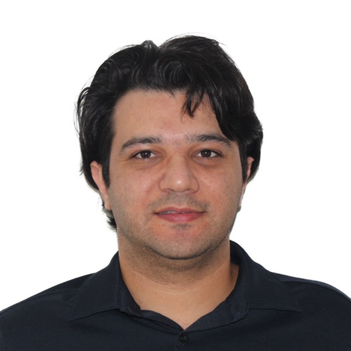

## Postdoctoral Researcher in Smart Manufacturing Analytics

:::: {.home-intro}

::: {.home-photo}

:::

::: {.home-summary}
I am a postdoctoral researcher at the University of South Carolina working on data-driven analytics for smart manufacturing systems.

My research develops AI-enabled methods for understanding, forecasting, and improving complex manufacturing systems through time-series analytics, machine learning, deep learning, digital twins, agentic AI, and collaborative industrial intelligence. I am especially interested in methods that connect data-rich manufacturing environments with trustworthy decision support.
:::

::::

## At a Glance

**Current role:** Postdoctoral Fellow, University of South Carolina  
**Research area:** Smart manufacturing analytics and industrial AI  
**Training:** Ph.D. in Industrial Engineering, West Virginia University  
**Dissertation:** *A Data-driven Time-Series Analytics Framework for Smart Manufacturing Systems*

## Research Focus

- Time-series forecasting, classification, and pattern recognition for smart manufacturing.
- Machine learning and deep learning for quality improvement, defect detection, and predictive maintenance.
- Agentic AI, multi-agent systems, and digital twins for manufacturing decision support.
- Federated learning and blockchain-enabled analytics for secure collaborative manufacturing.

## Selected Work

- Experimental evaluation of time-series forecasting and classification algorithms for smart manufacturing systems.
- Real-time defect detection and classification in robotic assembly lines.
- Digital twin enabled robot collision detection using time-series forecasting.
- Federated learning and blockchain frameworks for privacy-preserving manufacturing analytics.

## Navigate

- [News](news.qmd): Recent updates.
- [Research](research.qmd): Research themes and current directions.
- [Publications](publications.qmd): Journal articles, conference papers, preprints, and reports.
- [Projects](projects.qmd): Selected research and applied engineering projects.
- [Teaching](teaching.qmd): Teaching experience and course support.
- [CV](cv.qmd): Concise web CV and downloadable academic CV.
- [Contact](contact.qmd): Email and professional profiles.
